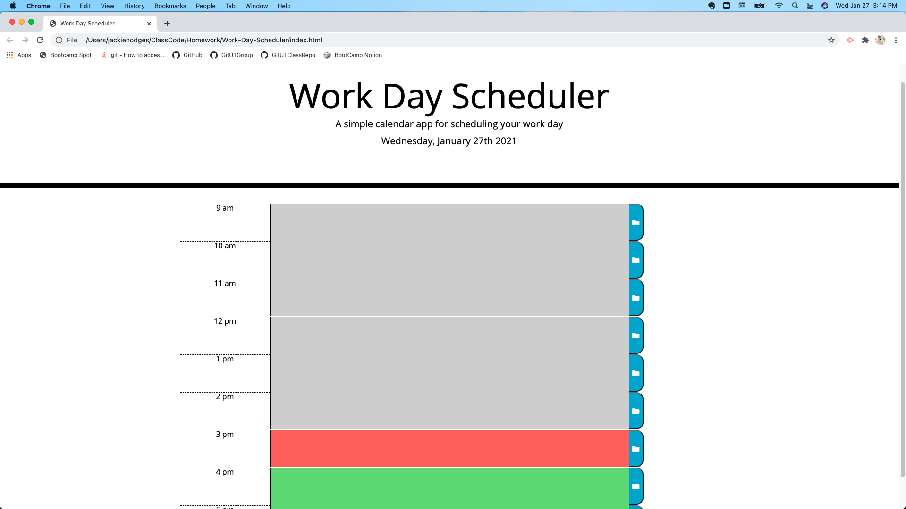
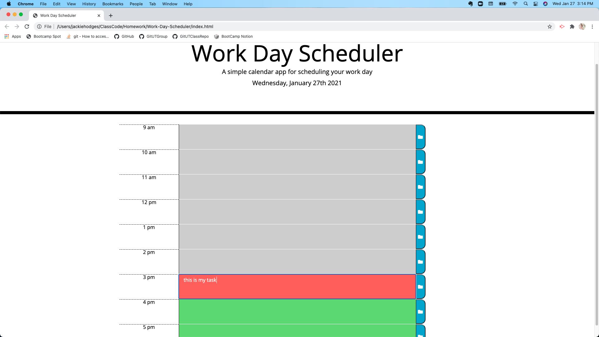

# Work-Day-Scheduler
Third Party APIs: Work Day Scheduler

## Description

The given starter code included a minimal HTML file, and a css style file that predefined certain styling to be applied throughout the code. I refactored the code to include a JavaScript file that used jQuery to dynamically update the page. The dynamic updates included:

* the implementation of the Moment.js library to display the current date,
* the creation and appending of HTML elements for the time blocks of the day,
* the logic needed to color code the time block when compared to the current time,
* the ability to type in a task in a time block and click the save button to store the task in local storage,
* and the saved task to persist on a refreshed page.

This type of program can help employees manage their time more effectively.

## Table of Contents

* [Installation](#installation)
* [Usage](#usage)
* [Credits](#credits)

## Installation

To install, pull repository and open html file in browser. Repository can be found here: [Work Day Scheduler Repo](https://github.com/JackieHodges/Work-Day-Scheduler)

Otherwise, the github page can be found here: [Work Day Scheduler Webpage](https://jackiehodges.github.io/Work-Day-Scheduler/)

## Usage

Below are screenshots of the page:

## Credits

I used the Moment.js library to aid in showing and comparing times. It can be found here: [Moment.js](https://momentjs.com/)

